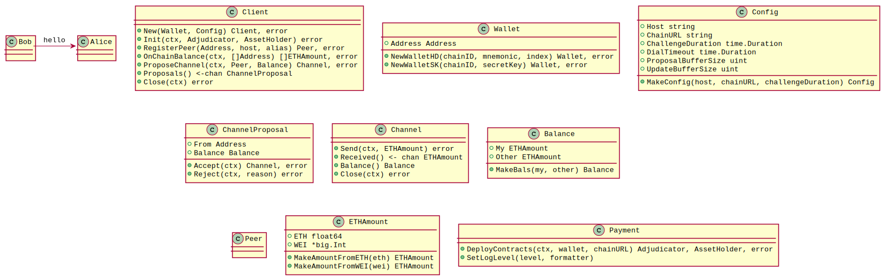

<h1 align="center"><br>
    <a href="https://perun.network/"></a>
<br></h1>

<h4 align="center">Perun Ethereum Payment Client</h4>

<p align="center">
  <a href="https://www.apache.org/licenses/LICENSE-2.0.txt"></a>
  <a href="https://pkg.go.dev/github.com/perun-network/perun-eth-payment?status.svg"> </a>
</p>

This project provides a simplified interface to the [*go-perun*](https://github.com/hyperledger-labs/go-perun) framework. It enables developers to get started quickly with *go-perun* by using a condensed API.  
If you just want to create a *go-perun* payment application on Ethereum, this is for you.

## Security Disclaimer

**Do not use this software with real funds**.

_go-perun_ is still in development.
The authors take no responsibility for any loss of digital assets or other damage caused by the use of this software.

## Primer

You can import _perun-eth-payment_ as go module:
```go
import "github.com/perun-network/perun-eth-payment"
```

Here is an example with the most important functions.  
It sets up the framework, opens a channel to *Bob*, sends him `0.5` *ETH*, waits for a return payment and shuts down.  

```go
package main

import (
	"context"
	"fmt"
	"math/big"
	"time"

	"github.com/ethereum/go-ethereum/common"
	ethwallet "perun.network/go-perun/backend/ethereum/wallet"
	payment "github.com/perun-network/perun-eth-payment"
)

func main() {
	// Initialize mnemonic wallet
	wallet, err := payment.NewWalletHD(big.NewInt(5), "your mnemonic", 1)
	if err != nil { /* handle error */ }
	
	// Setup config struct and client
	config := payment.MakeConfig("127.0.0.1:6444", "ws://127.0.0.1:8454", 60 * time.Second)
	client, err := payment.NewClient(wallet, config)
	if err != nil { /* handle error */ }
	// Long context that will be used from now on
	ctx, cancel := context.WithTimeout(context.Background(), 10 * time.Minute)
	defer cancel()

	// Set the contract addresses of the Adjudicator and Assetholder
	client.Init(ctx, common.HexToAddress("0x20e1D1642284AdB74520f0e91835bbc6d5ec3415"),
			         common.HexToAddress("0x3f6629d37E84E6Da88978198c9A1B228C5722085"))
	
	// Register the peer that we want to open a channel with.
	bobAddr := ethwallet.AsWalletAddr(common.HexToAddress("0xB5d05705c467bfEd944B6769A689c7766CC1f805"))
	bob, err := client.RegisterPeer(bobAddr, "192.168.2.100:6444", "Bob")
	if err != nil { /* handle error */ }

	// Set the initial balance for the channel and open it.
	initBals := payment.MakeBals(payment.MakeAmountFromETH(1), payment.MakeAmountFromETH(1))
	channel, err := client.ProposeChannel(ctx, bob, initBals)
	if err != nil { /* handle error */ }

	// Send 0.5 ETH to Bob
	err = channel.Send(ctx, payment.MakeAmountFromETH(0.5))
	if err != nil { /* handle error */ }
	// Wait for Bob to send us something back
	received := <-channel.Received()
	fmt.Printf("Received %v ETH from Bob", received.ETH())

	// Close the channel and client at the end
	err = channel.Close(ctx)
	if err != nil { /* handle error */ }
	err = client.Close(ctx)
	if err != nil { /* handle error */ }
}
```

## Architecture

The following UML diagram shows the complete interface in abbreviated form:

<a href=".assets/payment_client.svg"></a>

## Copyright

Copyright 2021 PolyCrypt GmbH  
Use of the source code is governed by the Apache 2.0 license that can be found in the [LICENSE file](LICENSE).

Contact us at [info@perun.network](mailto:info@perun.network).
